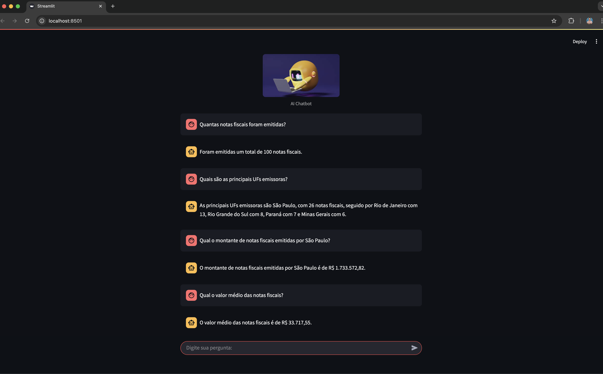

# AI Agent para Análise de Dados de Notas Fiscais

Sistema de IA para análise de dados de notas fiscais com arquitetura modular.

## 🏗️ Stack tecnológica, módulos e estrutura da solução

### 🛠️ Tecnologias Utilizadas

- **Python 3.8+**
- **Flask** - API REST
- **Streamlit** - Interface web
- **LangChain** - Processamento de IA
- **OpenAI GPT** - Modelo de linguagem
- **SQLite** - Banco de dados
- **Pandas** - Manipulação de dados
- **PyYAML** - Configurações

### 📁 Estrutura e módulos da solução

```
ai-agent-csv-python/
├── appAgent.py          # API Flask principal
├── chat.py              # Interface Streamlit para usuários
├── config.py            # Gerenciamento de configurações via YAML
├── config.yaml          # Arquivo de configuração
├── database.py          # Gerenciamento do banco de dados SQLite
├── ai_processor.py      # Processamento de IA com LangChain e OPENAI
├── memory_manager.py    # Gerenciamento de memória de conversas
├── file_processor.py    # Processamento de arquivos CSV/ZIP
├── requirements.txt     # Dependências
├── database/            # Pasta do banco SQLite
├── files/               # Arquivos de dados
│   ├── 202401_NFs.zip
│   └── csv-files/
└── images/              # Imagens da interface
```


## 🎯 Exemplos de Perguntas




## 🚀 Como Usar

### 1. Instalação

```bash
pip install -r requirements.txt
```

### 2. Configuração

Crie um arquivo de environment `.env` com sua chave da OPENAI na raiz do projeto

```bash
OPENAI_API_KEY=SUA_CHAVE_AQUI
```

### 3. Execução

Execute diretamente o arquivo principal:

```bash
python appAgent.py
```

O sistema irá:

- Descompactar automaticamente os arquivos ZIP necessários
- Criar e configurar o banco de dados
- Iniciar o servidor Flask na porta 5001

### 4. Interface Web

```bash
streamlit run chat.py
```
